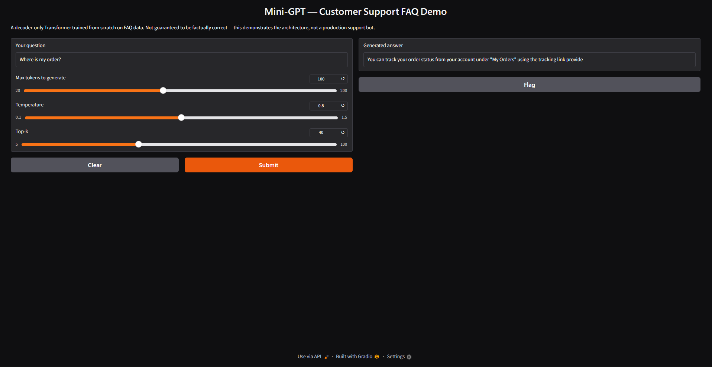
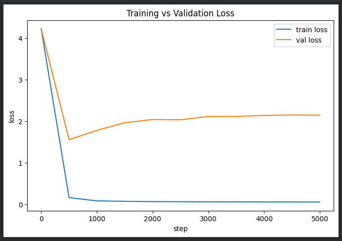
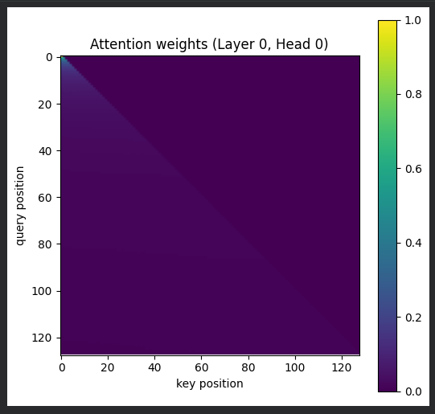

# 🧠 Mini-GPT — Built from Scratch

**Name:** Arin Malav  
**Course:** Data Science Internship  

---

## 📌 Project Overview

This project implements a **Mini GPT (Generative Pre-trained Transformer)** model from scratch using PyTorch.  
It is a **character-level, decoder-only Transformer**, inspired by modern Large Language Models.

The goal of this project is to understand how language models work internally by building one step-by-step — from tokenization to text generation.

---

## ⚙️ Key Features

- 🔤 Character-level tokenization
- 🧩 Embedding layer (token + positional embeddings)
- 🎯 Self-Attention mechanism
- 🧠 Multi-Head Attention
- 🏗️ Transformer Blocks (Decoder-only)
- 📉 Training with loss optimization
- ✂️ Gradient clipping for stability
- 🔄 Learning rate warmup + cosine decay
- 💾 Checkpointing support
- 🎲 Temperature & Top-k sampling for generation
- 📊 Loss curve visualization
- 🔍 Attention visualization

---

## 🧠 Model Architecture

This project follows a **decoder-only Transformer architecture**, similar to GPT models:

- Input → Token Embeddings + Positional Embeddings  
- Multiple Transformer Blocks:
  - Self-Attention
  - Feed Forward Network
- Output → Probability distribution over next character  

---

## 📂 Project Structure

```
Mini-GPT-project/
│
├── mini_gpt_Arin_Malav.ipynb   # Main implementation
├── README.md                   # Project documentation
│
├── Data/
│   └── input.txt               # Training dataset
│
├── assets/
│   ├── output.png              # Generated text output
│   ├── loss_curve.png          # Training loss graph
│   └── attention_visualization.png  # Attention maps
```

---

## 📊 Sample Output

### 🔹 Generated Text


---

### 📉 Loss Curve


---

### 🔍 Attention Visualization


---

## 📁 Dataset

A small **FAQ-style text dataset** is used for training.  
The model learns character patterns and generates similar structured responses.

Location:
```
data/input.txt
```

---

## 🚀 How to Run

1. Open the notebook:
   ```
   mini_gpt_Arin_Malav.ipynb
   ```
2. Run all cells sequentially
3. The model will:
   - Load dataset
   - Train
   - Generate text output

---

## 🛠️ Technologies Used

- Python
- PyTorch
- NumPy
- Matplotlib
- Jupyter Notebook

---

## 🎯 Learning Outcomes

- Understanding of Transformer architecture
- Working of self-attention mechanism
- Training loop and optimization techniques
- Text generation using probabilistic sampling
- Visualization of model behavior

---

## ⚠️ Limitations

- Small dataset → limited generalization
- Character-level model → slower text understanding compared to word-level
- Not comparable to large-scale LLMs

---

## 📌 Future Improvements

- Use larger dataset
- Switch to subword/token-level tokenization
- Train deeper Transformer
- Deploy as a web app
- Add chat interface

---

## ✅ Conclusion

This project demonstrates a **complete end-to-end implementation of a GPT-style model**, helping build a strong foundational understanding of modern AI systems.

---
